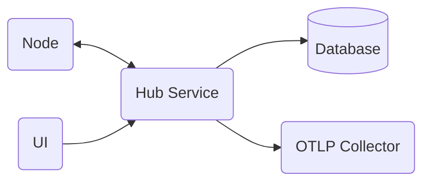

> :exclamation: This repository and README are still in very early stages; hence, the incomplete docs.

# Summary
This repository contains multiple applications which provide a central UI and database for viewing and managing home automation devices. A hub service exposes REST api's for remote network-connected nodes to send data to the central database. The remote nodes can be any types of devices. The most common usecase will be temperature and humidity sensors connected to a raspberry pi. The raspberry pi will collect data from connected sensors and send updates back to the hub service to be logged to a database. Additionaly, the pi will expose a healthcheck endpoint for the hub service to validate a registered node is still active and healthy.

# Application Components



## Runtime Platform
The applications will be implemented on the .Net platform. ASP.Net services will support the REST API's. Blazor WASM will be used to build the UI.

Applications will be containerized in Docker to support crossplatform development and execution. 
## UI
## Hub Service
## Database
## Nodes
## OpenTelemetry

# Infrastructure Components

## Build and Deployment Pipeline
## Docker
The 

### Tagging
Currently just using unique tags described in [Microsoft best practices](https://docs.microsoft.com/en-us/azure/container-registry/container-registry-image-tag-version). Eventually stable tags will also be used to define latest and specific versions of the images. Semantic versioning will be used and the unique tag will switch from the build ID to the full patch version.

Currently the unique ID is the build ID of the Azure DevOps pipeline build. As seen below the `$(Build.BuildId)` pre-defined pipeline variable is used to easily add the version tag.

```yaml
    - task: Docker@2
      displayName: Build an image
      inputs:
       repository: $(ImageName)
       command: build
       Dockerfile: $(DockerfileLocation)
       buildContext: $(SolutionDirectory)
       tags: |
        $(Build.BuildId)
```
## Kubernetes
Unknown yet whether I will use Kubernetes or Compose. The main "cluster" will likely be running on a raspberry pi and doesn't really need the scaling and ingress features of a k8s cluster.