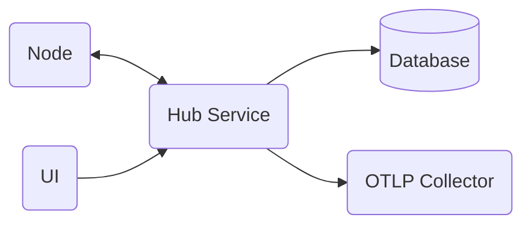

> :exclamation: This repository and README are still in very early stages; hence, the incomplete docs.

# Summary
This repository contains multiple applications which provide a central UI and database for viewing and managing home automation devices. A hub service exposes REST API's for remote network-connected nodes to send data to the central database. The remote nodes can be any types of devices. The most common use case will be temperature and humidity sensors connected to a raspberry pi. The raspberry pi will collect data from connected sensors and send updates back to the hub service to be logged to a database. Additionally, the pi will expose a health-check endpoint for the hub service to validate a registered node is still active and healthy.

# Testing

- E2E
- Integration
- Unit

## End-To-End (E2E)
Can be UI testing against a deployed application or "sub-service" API tests that validate a business workflow against the API layer. Usually run against a fully deployed environment after the deployment of new code.

Companies often fall into the trap of trying to automate all of thier manual tests with UI testing tools. This is helped by the availability of many tools that advertise easy generation and recording of manual workflows. This is an anti-pattern of a successful CI/CD strategy. UI tests are brittle and difficult to maintain. Relying on thousands of Selenium--or similar style--tests will end up in a test suite that is not reliable and is either ignored or delays deployments by weeks. That is not a good position to be in when you want to deploy quickly to production. In short, minimize your E2E tests and rely on a good set of unit and integration tests instead. 

## Integration
Tests that a full application instance can interact with an external component. I like to group "contract" testing under the integration category. Contract and certain integration style tests can be run during the build of an application to validate external components in the dev/qa environment pass uptime/contract requirements prior to even deploying the application.

Healthchecks in conjuction with monitoring are a style of integration testing as well. Validating that the application is connecting with external dependencies post-deployment.

## Unit
I like to group both traditional unit testing and UI component testing under this category. The category can be simplified to any test that targets and tests in isolation an individual component of the application. Unit tests will always be run as part of local development and the application's build stage. 

# Application Components



## Runtime Platform
The applications will be implemented on the .Net platform. ASP.Net services will support the REST API's. Blazer WASM will be used to build the UI.

Applications will be containerized in Docker to support cross-platform development and execution. 
## UI
## Hub Service
## Database
> :exclamation: The application is currently using an in-memory database. This is to ease the initial setup of the project and test project. Unsure yet what the final database implementation will be. EF Framework allows for a relatively easy abstraction of database query logic away from the underlying implementation.

The repository pattern is used in conjunction with EFFrameworkCore to simplify testing.                                           
## Nodes
## OpenTelemetry

# Infrastructure Components

## Build and Deployment Pipeline

> :bulb: No deployment stages are added yet. A dev/qa environment will need added for executing tests and a production stage for running the full application. Unsure yet where dev/qa will run, possibly Azure. Production will likely be hosted on a raspberry pi. An Azure DevOps agent can be installed directly on the pi to automate deployments.

The build and deployment pipeline is automated with Azure DevOps pipelines. Github branch policies force PR's to be created for the main branch and the [HubService.Pipeline](https://dev.azure.com/JRCampbell2/Home-Automation/_build?definitionId=4&_a=summary) is executed for each push of code to the PR.

The type of build executed by the HubService.Pipeline depends on whether it is triggered by a merge to main or by a pull request. If it is from a pull request trigger then it runs the [gated build](/eng/gated-build-template.yml). If it is from a merge to main it runs the [full build](/eng/full-build-deploy-template.yml). The gated and full build logic is separated by the use of Azure DevOps pipeline template. A "root pipeline" is created for each application that requires a deployment pipeline, this root pipeline dynamically selects which template to use for each individual run.

### Root Pipeline

> :bulb: Example: This is the [HubService's](/eng/hub-service-pipeline.yml) root pipeline. 

The root pipeline dynamically selects whether to run a full build or gated build depending on the source branch. I am planning on creating a unique root pipeline file per application pipeline. Alternatively you could use variables to defined inside Azure DevOps to make the root pipeline file re-usable. I prefer the unique file for transparency.

Below you can see the use of template expressions to select which template to use at the pipeline's compile time.
```yaml
stages:
- ${{ if eq(variables['Build.SourceBranchName'], 'main') }}:
  - template: full-build-deploy-template.yml
- ${{ else }}:
  - template: gated-build-template.yml
```

### Gated Build

The [gated build](/eng/gated-build-template.yml) is a single stage pipeline that executes a docker build without pushing the image to a container registry. The gated build runs whenever the pipeline is executed and the source branch is not main. This is leveraged by the Github branch policies to trigger a gated build as a status check in a PR.

The application's Dockerfile should execute the application's unit and integration tests.

### Full Build

The [full build](/eng/full-build-deploy-template.yml) is a multi-stage pipeline that builds a new docker image and pushes it to a container registry and then deploys the new images to downstream environments.

The first stage, the build stage, runs the docker build and push commands. This will build and test the underlying application and push the image to Azure Container Registry (ACR). The next stage would be the deployment to the dev/qa environment. The dev/QA deployment stage should both pull and deploy the latest image, but it should also execute any E2E tests in the environment.

## Database
> :exclamation: The application is currently using an in-memory database. This is to ease the initial setup of the project and test project. Unsure yet what the final database implementation will be. EF Framework allows for a relatively easy abstraction of database query logic away from the underlying implementation.

## Docker
Each Dockerfile will build an image of a single .Net solution. The Dockerfile should be built as a multi-stage build so that the dotnet restore commands can be cached and the sdk image separated from the final layer. 

The [HubService Dockerfile](/HubService/Hubservice/Dockerfile) is an example of a .Net multistage Dockerfile in this repository. An important call out is that the docker build will execute the dotnet test command as well, running the functional and integration tests from inside the container. A future enhancement will allows developers to disable the test during a local build to speed up build times.

### Tagging
Currently just using unique tags described in [Microsoft best practices](https://docs.microsoft.com/en-us/azure/container-registry/container-registry-image-tag-version). Eventually stable tags will also be used to define latest and specific versions of the images. Semantic versioning will be used and the unique tag will switch from the build ID to the full patch version.

Currently the unique ID is the build ID of the Azure DevOps pipeline build. As seen below the `$(Build.BuildId)` pre-defined pipeline variable is used to easily add the version tag.

```yaml
    - task: Docker@2
      displayName: Build an image
      inputs:
       repository: $(ImageName)
       command: build
       Dockerfile: $(DockerfileLocation)
       buildContext: $(SolutionDirectory)
       tags: |
        $(Build.BuildId)
```
## Kubernetes
Unknown yet whether I will use Kubernetes or Compose. The main "cluster" will likely be running on a raspberry pi and doesn't really need the scaling and ingress features of a k8s cluster.

## Container Registry
Azure Container Registry (ACR) is being used to store images generated by the automated build process.