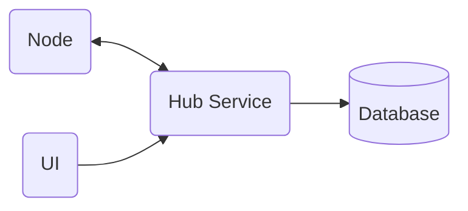

# Summary
This repository contains multiple applications which provide a central UI and database for viewing and managing home automation devices. A hub service exposes REST api's for remote network-connected nodes to send data to the central database. The remote nodes can be any types of devices. The most common usecase will be temperature and humidity sensors connected to a raspberry pi. The raspberry pi will collect data from connected sensors and send updates back to the hub service to be logged to a database. Additionaly, the pi will expose a healthcheck endpoint for the hub service to validate a registered node is still active and healthy.

# Application Components

## Runtime Platform
The applications will be implemented on the .Net platform. ASP.Net services will support the REST API's. Blazor WASM will be used to build the UI.

Applications will be containerized in Docker to support crossplatform development and execution. 
## UI
## Hub Service
## Database
## Nodes

# Infrastructure Components

## Build and Deployment Pipeline
## Docker
## Kubernetes